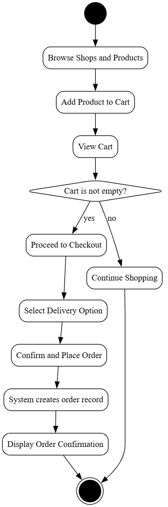

# UML Diagrams

This document contains the Use Case, Sequence, and Activity diagrams for the Local Vendor Shop application.

---
### **1. Use Case Diagram**

This diagram shows the interactions between the **Customer** and **Vendor** actors and the system's main functionalities.

---
### **2. Sequence Diagram (Order Placement)**

This diagram illustrates the sequence of interactions that occur when a customer places an order, from the browser to the server and database.

---
### **3. Activity Diagram (Order Flow)**

This diagram shows the workflow a customer follows from browsing products to successfully placing an order.

